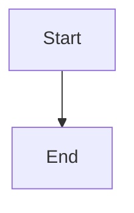

# Bug Report

### Describe the bug

Mermaid code blocks are not being rendered correctly in MDX files. When I add a mermaid diagram using the standard code fence syntax with `mermaid` language identifier, nothing appears on the page.

### Reproduction

```markdown

```

The diagram should render but instead the code block just disappears from the output.

### Expected behavior

Mermaid diagrams should be transformed and rendered as interactive diagrams when using code blocks with the `mermaid` language identifier.

### System Info

- Docusaurus version: latest
- Node version: 18.x
- OS: macOS

This was working fine before but seems to have broken recently. The mermaid code blocks are just not being processed at all now.

---
Repository: /testbed
